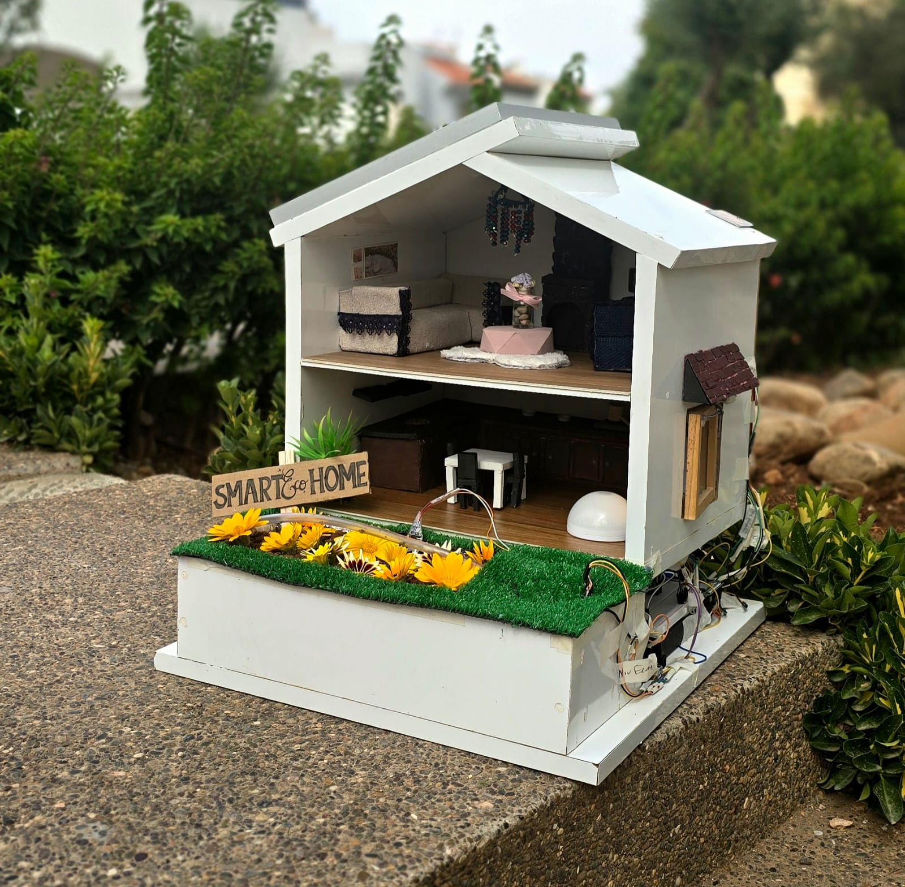
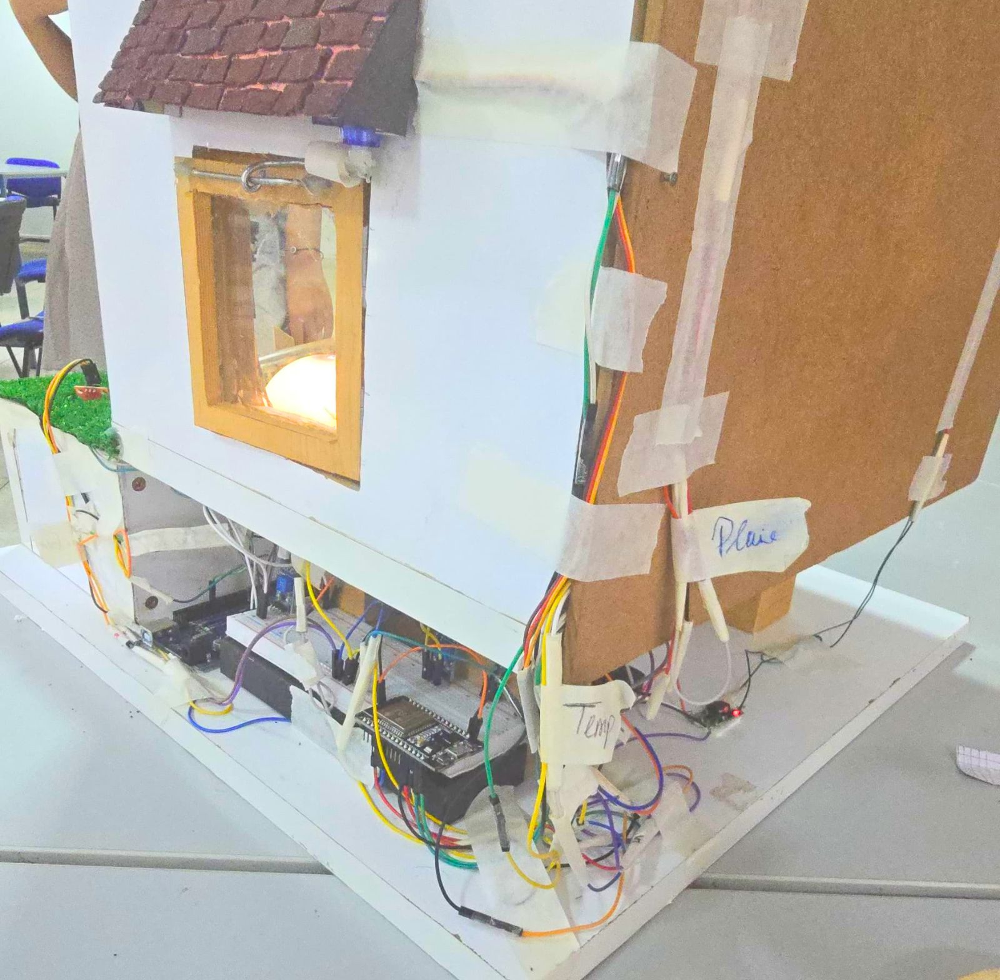

# VART (Voice-Activated Real-time Telemetry) Edge-AI Assistant

VART is a futuristic Edge-AI hardware console that bridges physical sensors, keypad authentication, and a visual browser HUD using an ESP32 hardware target (LilyGo T-A7670E R2) and a FastAPI backend powered by high-speed Groq LLMs.


*Fig 1 & 2: VART project concepts and technology brochure.*

---

## ⚡ Core Use Cases & Architectures

VART is designed as a modular core that can adapt to multiple high-impact scenarios:

### 1. Wireless Smart Home Automation (via ESP-NOW)
VART can operate as the central command node for your home without running any physical wires. It leverages the high-speed, low-latency **ESP-NOW** wireless protocol.
* **Master Node**: The VART console ESP32 (running this firmware). It receives voice commands from the Web HUD or physical keypad, validates credentials, and acts as the brain.
* **Slave (Esclave) Nodes**: Scattered throughout the house, controlling lights, relays, smart plugs, and appliances.
* When the user gives a voice instruction, the Master node decodes the command and broadcasts it instantly over ESP-NOW to trigger action on the receiving smart home devices.



*Fig 3 & 4: Smart Home design models showing relay actuators and wireless nodes.*

---

### 2. Office & Bureau Productivity Assistant (via MCP)
VART can act as a proactive bureau companion for office workers. By integrating with **Model Context Protocol (MCP)**, the assistant can securely access your professional tools:
* **Task & Calendar Sync**: Look at VART or query it by voice to list your tasks, schedule meetings, or receive calendar alerts.
* **Email Management**: Keep track of new Gmail messages, draft responses, and summarize inbox traffic instantly.
* **Eye-Tracking & Voice Triggering**: With native hardware sensor integration, VART can wake up and respond fast just by looking in its direction or speaking.

---

### 3. Private Local Enterprise RAG Engine (100% Offline)
For corporate and enterprise security, VART can be fully decoupled from the cloud.
* **Local LLM**: Replace the cloud API with a local inference engine (such as Llama 3 via Ollama or Llama.cpp) running directly on local hardware.
* **Private RAG (Retrieval-Augmented Generation)**: Feed VART with your company's private documentation, manuals, and data sheets. The AI runs locally, ensuring that no sensitive corporate data ever leaves the local network.

---

## 🖥️ Web HUD Console Interface Walkthrough

The browser-based dashboard provides a real-time window into VART's system telemetry and cognitive state.

### A. Connection Status Panel
Displays real-time connection status (WebSocket and Serial), serial port location, and authentication credentials. When unlocked via the physical keypad, it shifts visual states to reflect active clearance.


*Fig 5: Connection Status Panel showing real-time port telemetry.*

### B. Cognitive Interaction & Voice Core
This module handles communication. Users can toggle the high-fidelity microphone (which records audio locally and sends it to Groq's Whisper API) or type direct queries. Subtitles show both raw transcription and VART's spoken response.


*Fig 6: The voice and text engagement panel.*

### C. Live Log Stream Monitor
A scrolling terminal that streams serial communications directly from the ESP32 (such as sensor logs and keypad inputs) alongside internal FastAPI and AI processing logs.


*Fig 7: The live system log monitor streaming telemetry.*

### D. HUD Visual State Images
VART shifts its avatar representation on the dashboard depending on the physical connection and system status:
* **Keypad Passcode Challenge (`stat/code keypad.jpeg`)**: Prompt overlay shown when the system is waiting for the keypad code to be entered.
* **Active Status Face (`stat/on.jpeg`)**: System face expression shown when VART is operational and systems are online.
* **Serial Disconnected (`stat/unpluged.jpeg`)**: Warning overlay shown when the serial connection between PC and ESP32 board is unplugged.
* **WebSocket Offline (`stat/lose connection.jpeg`)**: Warning screen displayed if the WebSocket stream connection between browser and server is lost.

---

## 🤖 Future 3D Physical Form Factor

To take VART out of the browser and into the real world, the next phase is wrapping the hardware in a custom-designed **3D physical robot body**. Equipped with movable eyes, articulating limbs, and integrated speakers/microphones, VART will transition from a console HUD into an interactive, desk-friendly hardware companion.


*Fig 8: Concept render of the physical 3D-printed VART assistant.*

---

## ⚙️ LilyGo T-A7670E R2 Hardware Pinout

The physical setup is wired directly to the **LilyGo T-A7670E R2 (ESP32)** board. Below are the exact pin allocations mapped from `espcode.ino`.


*Fig 9: LilyGo T-A7670E R2 board used in the project.*

### 📍 Wiring Connections Table

| Sensor/Peripheral | ESP32 GPIO Pin | Connection Type & Description |
|---|---|---|
| **I2C LCD Display (SDA)** | **GPIO 21** | I2C Data Line (Serial Data) |
| **I2C LCD Display (SCL)** | **GPIO 22** | I2C Clock Line (Serial Clock) |
| **DHT11 Data Pin** | **GPIO 18** | Isolated Digital Input (Temperature & Humidity) |
| **LDR (Soleil Sensor)** | **GPIO 35** | Analog Input Pin (Light Status monitoring) |
| **RGB LED - Red** | **GPIO 19** | PWM Output (Red channel) |
| **RGB LED - Green** | **GPIO 23** | PWM Output (Green channel) |
| **RGB LED - Blue** | **GPIO 12** | PWM Output (Blue channel) |
| **Keypad Row 0** | **GPIO 15** | Row 0 matrix scanning line |
| **Keypad Row 1** | **GPIO 14** | Row 1 matrix scanning line |
| **Keypad Row 2** | **GPIO 13** | Row 2 matrix scanning line |
| **Keypad Row 3** | **GPIO 2** | Row 3 matrix scanning line |
| **Keypad Col 0** | **GPIO 5** | Column 0 matrix scanning line |
| **Keypad Col 1** | **GPIO 0** | Column 1 matrix scanning line |
| **Keypad Col 2** | **GPIO 33** | Column 2 matrix scanning line |
| **Keypad Col 3** | **GPIO 32** | Column 3 matrix scanning line |

---

## 🚀 Quick Start Guide

### 1. Requirements
* Python 3.10+
* LilyGo T-A7670E R2 board (running `espcode.ino`)
* Libraries: `pyserial`, `fastapi`, `uvicorn`, `websockets`, `groq`

### 2. Environment Setup
Configure your Groq API key by placing it in a `.env` file in the project root:
```text
GROQ_API_KEY=your-api-key-here
```

### 3. Running the System
Start the FastAPI backend:
```bash
python main.py
```
The browser HUD will automatically launch at `http://127.0.0.1:8000`.
